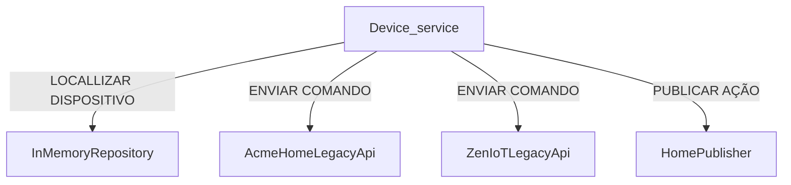

# Diagrama de Componentes - Device Service

## 1. Componente analisado

O componente escolhido foi o `Device_service`, responsável pelo controle e execução de comandos nos dispositivos do sistema SafeHome.

---

## 2. Diagrama de Componentes

---

